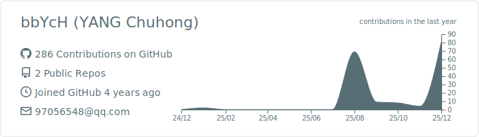

<div align="left">

# Hi there， I am ... 👋
<a href="https://bbych.github.io/">
  
</a>

### 🎓 A Post-graduate Student focusing on Power Systems & Optimization.
- 🔭 I’m currently working on ...
- 🌱 I’m currently learning ...
- 👯 I’m looking to collaborate on ...
- 🤔 I’m looking for help with ...
- 💬 Ask me about ...
- 📫 How to reach me: ...
- 😄 Pronouns: ...
- ⚡ Fun fact: ...

---

### 💻 Development Environment
*I work across multiple platforms.*


<br/>

### 🛠 Core Languages
*My primary weapons for modeling, simulation, and algorithm implementation.*


<br/>

### ⚡ Research & Visualization Tools
*Specialized tools for Analysis，Description and Presentation.*


<br/>


<br/>

### 🧮 Optimization Solvers
*The heavy lifters for solving complex Operation and Planning problems.*


<br/>
<br/>

---
### 📊 GitHub Activity

<picture>
  <source media="(prefers-color-scheme: dark)" srcset="https://raw.githubusercontent.com/bbYcH/bbYcH/output/github-contribution-grid-snake-dark.svg">
  <source media="(prefers-color-scheme: light)" srcset="https://raw.githubusercontent.com/bbYcH/bbYcH/output/github-contribution-grid-snake.svg">
  
</picture>

<br/>

<!-- <p align="left">
  
</p> -->

<!--START_SECTION:waka-->
**I'm an Early 🐤** 

```text
🌞 Morning                13 commits          █░░░░░░░░░░░░░░░░░░░░░░░░   04.28 % 
🌆 Daytime                184 commits         ███████████████░░░░░░░░░░   60.53 % 
🌃 Evening                93 commits          ████████░░░░░░░░░░░░░░░░░   30.59 % 
🌙 Night                  14 commits          █░░░░░░░░░░░░░░░░░░░░░░░░   04.61 % 
```
📅 **I'm Most Productive on Sunday** 

```text
Monday                   8 commits           █░░░░░░░░░░░░░░░░░░░░░░░░   02.63 % 
Tuesday                  40 commits          ███░░░░░░░░░░░░░░░░░░░░░░   13.16 % 
Wednesday                33 commits          ███░░░░░░░░░░░░░░░░░░░░░░   10.86 % 
Thursday                 52 commits          ████░░░░░░░░░░░░░░░░░░░░░   17.11 % 
Friday                   62 commits          █████░░░░░░░░░░░░░░░░░░░░   20.39 % 
Saturday                 33 commits          ███░░░░░░░░░░░░░░░░░░░░░░   10.86 % 
Sunday                   76 commits          ██████░░░░░░░░░░░░░░░░░░░   25.00 % 
```


📊 **This Week I Spent My Time On** 

```text
🕑︎ Time Zone: Asia/Shanghai

💬 Programming Languages: 
Python                   4 hrs 32 mins       █████████████████████████   100.00 % 

🔥 Editors: 
VS Code                  4 hrs 32 mins       █████████████████████████   100.00 % 
PyCharm                  0 secs              ░░░░░░░░░░░░░░░░░░░░░░░░░   00.00 % 

💻 Operating System: 
Linux                    4 hrs 32 mins       █████████████████████████   100.00 % 
Windows                  0 secs              ░░░░░░░░░░░░░░░░░░░░░░░░░   00.00 % 
```

**I Mostly Code in Python** 

```text
Python                   10 repos            █████████████████░░░░░░░░   66.67 % 
MATLAB                   4 repos             ███████░░░░░░░░░░░░░░░░░░   26.67 % 
SCSS                     1 repo              ██░░░░░░░░░░░░░░░░░░░░░░░   06.67 % 
```


 Last Updated on 30/12/2025 18:53:23 UTC
<!--END_SECTION:waka-->

</div>
