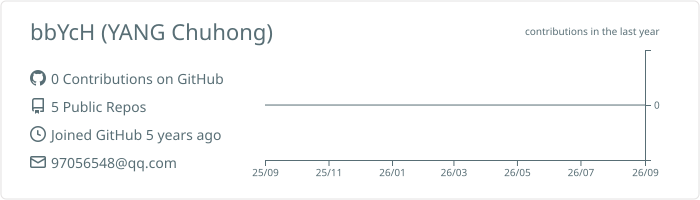

<div align="left">

[](https://www.youtube.com/watch?v=SDkAGkd4NLc)

###  Hi there! 
<a href="https://bbych.github.io/"></a>


###  Development Environment


<br/>

###  Core Languages


 
<br/>

###  Research & Visualization Tools


<br/>


<br/>

###  Optimization Solvers


<br/>
<br/>


###  GitHub Activity

<picture>
  <source media="(prefers-color-scheme: dark)" srcset="https://raw.githubusercontent.com/bbYcH/bbYcH/output/github-contribution-grid-snake-dark.svg">
  <source media="(prefers-color-scheme: light)" srcset="https://raw.githubusercontent.com/bbYcH/bbYcH/output/github-contribution-grid-snake.svg">
  
</picture>

<br/>

<!-- <p align="left">
  
</p> -->

<!--START_SECTION:waka-->
**I'm an Early 🐤** 

```text
🌞 Morning                14 commits          █░░░░░░░░░░░░░░░░░░░░░░░░   04.52 % 
🌆 Daytime                187 commits         ███████████████░░░░░░░░░░   60.32 % 
🌃 Evening                95 commits          ████████░░░░░░░░░░░░░░░░░   30.65 % 
🌙 Night                  14 commits          █░░░░░░░░░░░░░░░░░░░░░░░░   04.52 % 
```
📅 **I'm Most Productive on Sunday** 

```text
Monday                   8 commits           █░░░░░░░░░░░░░░░░░░░░░░░░   02.58 % 
Tuesday                  40 commits          ███░░░░░░░░░░░░░░░░░░░░░░   12.90 % 
Wednesday                33 commits          ███░░░░░░░░░░░░░░░░░░░░░░   10.65 % 
Thursday                 53 commits          ████░░░░░░░░░░░░░░░░░░░░░   17.10 % 
Friday                   63 commits          █████░░░░░░░░░░░░░░░░░░░░   20.32 % 
Saturday                 35 commits          ███░░░░░░░░░░░░░░░░░░░░░░   11.29 % 
Sunday                   78 commits          ██████░░░░░░░░░░░░░░░░░░░   25.16 % 
```


  **This Week I Spent My Time On** 

```text
🕑︎ Time Zone: Asia/Shanghai

💬 Programming Languages: 
Python                   18 hrs 1 min        █████████████████████████   98.64 % 
CSV                      14 mins             ░░░░░░░░░░░░░░░░░░░░░░░░░   01.36 % 

🔥 Editors: 
Trae                     16 hrs 22 mins      ██████████████████████░░░   89.60 % 
VS Code                  1 hr 25 mins        ██░░░░░░░░░░░░░░░░░░░░░░░   07.77 % 
PyCharm                  28 mins             █░░░░░░░░░░░░░░░░░░░░░░░░   02.62 % 

 Operating System: 
Linux                    17 hrs 47 mins      ████████████████████████░   97.38 % 
Windows                  28 mins             █░░░░░░░░░░░░░░░░░░░░░░░░   02.62 % 
```

** I Mostly Code in Python** 

```text
Python                   10 repos            █████████████████░░░░░░░░   66.67 % 
MATLAB                   4 repos             ███████░░░░░░░░░░░░░░░░░░   26.67 % 
SCSS                     1 repo              ██░░░░░░░░░░░░░░░░░░░░░░░   06.67 % 
```


 Last Updated on 11/01/2026 18:50:07 UTC
<!--END_SECTION:waka-->


###  Contact with Me

</div>
